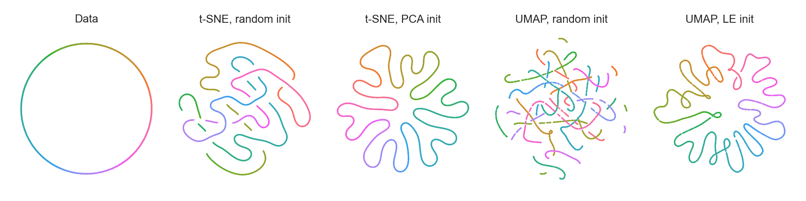

# Initialization is critical for preserving global data structure in both *t*-SNE and UMAP

The code for Figure 1 in the Matters Arising published in *Nature Biotechnology*: https://www.nature.com/articles/s41587-020-00809-z.

Also, an associated animation:

